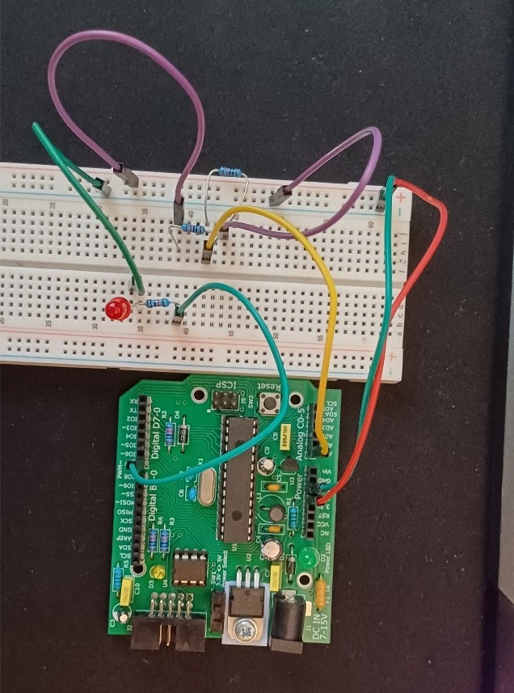

# Resistor Screamer
Creative way to measure and display the resistance of a resistor with an arduino. This project is more for fun than for functionality.

This project was done as an open ended part of an assignment for my ENEL220 course.

Created: May 2025 \
Posted to GitHub: Jul 2026

## Original Question: Colourful Accessible Resistors
    "Think of a way to help colourblind people figure out resistor colour bands 
     without using a multimeter.

     You can be as boring or creative as you wish!"

## Approach Outcome
To find a way to help colourblind people (or people like me who don’t have time to memorize colour bands), I found a way to communicate the value of a resistor using audio.

I set up a voltage divider between a 10 kΩ resistor and the resistor to be measured and connected these to an Arduino UNO. The Arduino determines the value of the resistor and outputs a pulse that triggers a buzzer (or an LED for a visual output to protect your hearing). I tested the setup as shown in figure 6.

\
Figure 6: Arduino and breadboard setup of ‘resistor-screamer’.

I wanted the device to be able to ‘beep’ a buzzer in three different ways depending on its setting:\
    1.	In morse code\
    2.	In a binary sequence\
    3.	Individually counting out each value of resistance
    
Due to the accuracy of the Arduino’s analogue readings, the value that the Arduino UNO can read becomes unreliable when it needs to read high resistance values.

## Hardware
- Arduino UNO
- Breadboard
- Buzzer (LED for silent version)
- 10 kΩ resistor
- Resistor to be measured
## Declaration
The code used is not completely my own. ChatGPT was used to find a linked list library to use for the binary algorithm and to help put together the ‘beepMorse()’ function. Since I was logged out at the time, the transcript of the conversation was lost.
